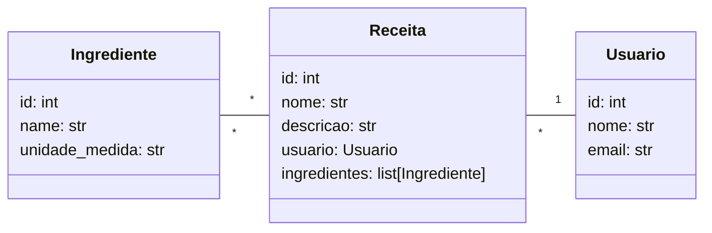

# - Sistema de receitas 🍲

API Web para gerenciamento de receitas culinárias, 
usuários e ingredientes, desenvolvida com FastAPI e MongoDB.


### 🛠 Tecnologias Utilizadas
- Python
- FastAPI
- MongoDB
- Beanie ODM
- Motor (driver assíncrono)
- uv (gerenciador de dependências)

### 🔎 Funcionalidades
- CRUD completo de usuários, ingredientes e receitas
- Relacionamentos entre coleções utilizando Link (Beanie)
- Consultas por ID
- Listagem de quantidade de receitas por usuário
- Busca textual case-insensitive
- Ordenações e contagens
- Documentação automática via Swagger


### ▶️ Como Executar
    
   O comando abaixo lê o arquivo `pyproject.toml`, consulta o `uv.lock`, instala automaticamente as dependências que estiverem faltando no ambiente virtual `.venv`, ativa o ambiente virtual e inicia o servidor da aplicação FastAPI.

``` 
uv venv  
uv sync  
.venv/bin/activate 
uvicorn app.main:app --reload  
``` 


## Diagrama de Classes UML

